# Relay Architecture

`pkg/relay` is a single-instance [Media over QUIC Transport](https://datatracker.ietf.org/doc/draft-ietf-moq-transport/)
(MoQT, §9 of `draft-ietf-moq-transport-18`) relay: an entity that is *both* a
Publisher and a Subscriber. It terminates Transport Sessions, caches Objects,
aggregates subscriptions, and forwards data between upstream publishers and
downstream subscribers.

This document explains how the package is organized, the data structures that
hold relay state, and the request/data flows that move bytes through it. For
*how to call* the public API, see the package doc comments; for the protocol
itself, follow the `§` citations to the IETF drafts.

> **Scope note.** This is *spec-driven* code. Almost every decision in here cites
> a draft section (`§10.2.11`, `§11.4.3`, …). When the prose below says "the
> relay MUST …", that is the draft talking, and the citation tells you where to
> verify it.

---

## 1. The big picture

The relay is **transport-agnostic**. It never imports a QUIC library; it
operates on the `session.Conn` / `session.Stream` abstraction and is handed a
`Listener` that yields connections with TLS + ALPN already negotiated. The
caller wires up the transport (quic-go, WebTransport, or an in-process test
adapter).

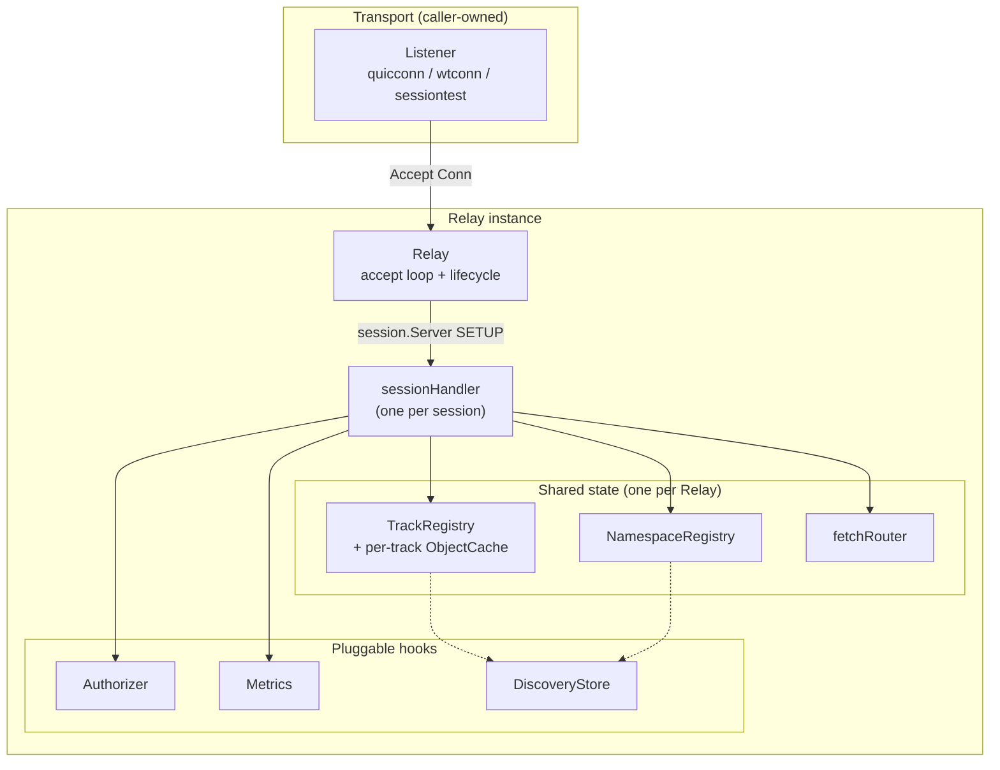

**Key idea:** the `Relay` is a thin lifecycle scaffold. Almost all behavior
lives in the per-session `sessionHandler`, which is a *façade* over shared
state — it owns no registries itself; they are injected and shared across every
session so subscriptions on one session can be fed by publishers on another.

### Package layout

| File | Responsibility |
|------|----------------|
| `relay.go` | `Relay` struct, `Listener` interface, `Config`, accept loop, graceful `Stop` / GOAWAY |
| `session_handler.go` | Per-session request / data / datagram loops, dispatch, rejection helpers |
| `handler_subscribe.go` | SUBSCRIBE, REQUEST_UPDATE, on-demand upstream SUBSCRIBE, §9.4 aggregation |
| `handler_publish.go` | PUBLISH, PUBLISH_BLOCKED, SUBSCRIBE_TRACKS forwarding |
| `handler_namespace.go` | PUBLISH_NAMESPACE / SUBSCRIBE_NAMESPACE / SUBSCRIBE_TRACKS |
| `handler_track_status.go` | TRACK_STATUS metadata query |
| `fanout.go` | Subgroup-stream object fanout + per-subscriber writer goroutines + slow-reader shedding |
| `datagram.go` | Datagram object fanout (the fire-and-forget sibling of `fanout.go`) |
| `fetch.go` | Standalone + Joining FETCH, **fetch stitching** from upstream + cache |
| `fetch_router.go` | Rendezvous between upstream FETCH responses and the handler that issued them |
| `newgroup.go` | NEW_GROUP_REQUEST (§10.2.13) parameter + DYNAMIC_GROUPS parsing |
| `track_registry.go` | `TrackRegistry` + `TrackEntry` — the central per-track control block |
| `namespace_registry.go` | `NamespaceRegistry` — who advertises / subscribes which namespace prefixes |
| `subscription.go` | `Subscription` state machine, `UpstreamSub` / `DownstreamSub`, §7.2 priority |
| `auth.go` | `Authorizer` interface, `DeniedError`, `AllowAllAuthorizer` |
| `limiter.go` | Per-session §13.1 / §13.7.1 resource caps |
| `metrics.go` | `Metrics` telemetry interface + `NopMetrics` |
| `cache/` | Per-track FIFO ring-buffer `ObjectCache` (§9.4 fetch support) |
| `discovery/` | Cross-instance track + namespace advertisement fabric (`MemoryStore`) |

---

## 2. Session lifecycle

`Relay.Start` runs an accept loop; each accepted `Conn` gets its own goroutine
that drives SETUP and then the per-session protocol loops.

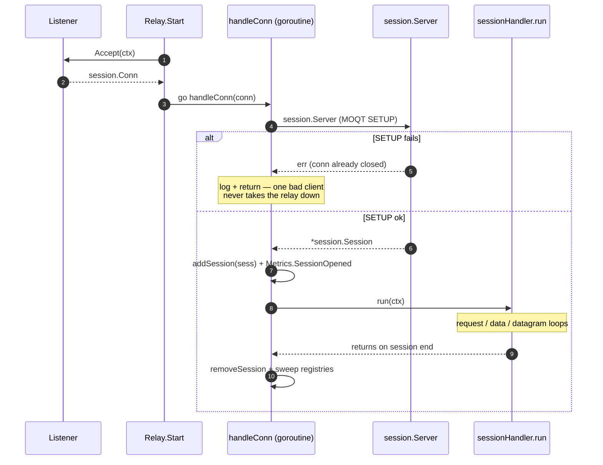

`run` spawns three loops under one `WaitGroup` and ties them to a shared
`runCtx`:

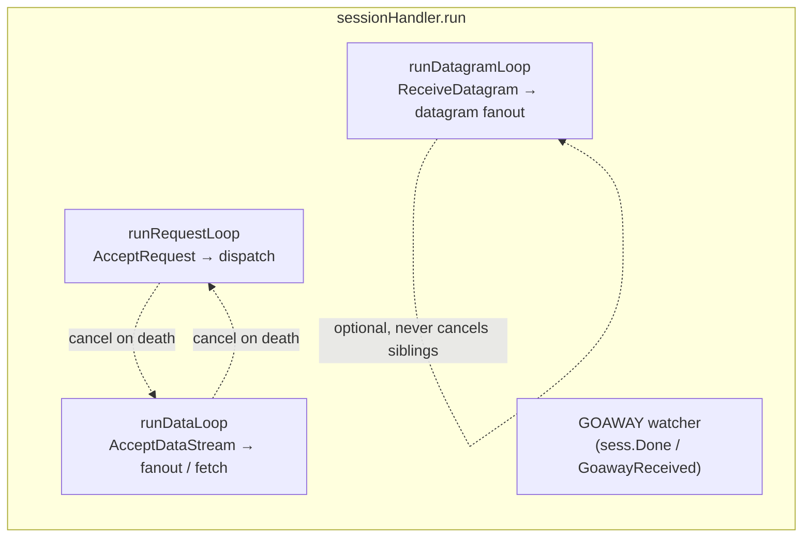

- **Request and data loops are load-bearing.** If either dies, the session is
  unusable, so each cancels `runCtx` to unwind the other.
- **The datagram loop is optional** (§11.6). A transport without DATAGRAM
  support fails on the first `ReceiveDatagram`; that must not kill SUBSCRIBE /
  PUBLISH, so the datagram loop neither cancels siblings nor promotes its error.
- **Per-request errors never terminate a loop** (§9.5): a malformed or
  unauthorized request is rejected individually and the session keeps serving.
  Only transport-level read errors end a loop.

### Graceful shutdown

`Relay.Stop` is idempotent (guarded by `sync.Once`) and runs a five-step drain:

1. Close the listener (unblocks the accept loop).
2. Broadcast GOAWAY to every live session (if `GoawayTimeout > 0`).
3. Wait up to `GoawayTimeout` for sessions to drain on their own.
4. Force-close stragglers with `SessionGoawayTimeout`.
5. `WaitGroup`-join all handler goroutines before returning.

A subtle race — `Stop` snapshots the live-session set *before* a just-accepted
session calls `addSession` — is covered twice: `addSession` checks `stopCh` and
sends its own GOAWAY, and each handler runs its own GOAWAY watcher. `SendGoaway`
is idempotent, so the redundant call is a silent no-op.

---

## 3. Core state: the Track Registry

The `TrackRegistry` is *the* rendezvous point. Everything that addresses a
track — request handlers, fanout, cache, discovery — goes through it. It maps
`track.Key` → `*TrackEntry`.

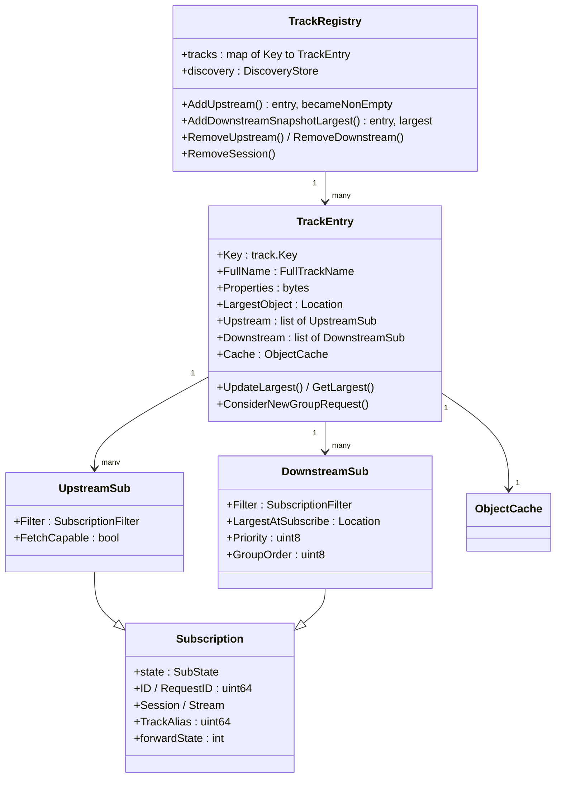

A `TrackEntry` is created on the first SUBSCRIBE or PUBLISH for a track and
destroyed when *both* its `Upstream` and `Downstream` slices empty. `Upstream`
is a **slice, not a single value**, so the relay can represent the cases §9.3 /
§9.5.1 allow: multiple independent publishers, graceful publisher switchover
(WiFi → cellular), and N-redundant origins (dedup by `{GroupID, ObjectID}` in
the cache).

### Subscription state machine

Both `UpstreamSub` and `DownstreamSub` embed `Subscription`, whose state is
strictly linear and one-way:

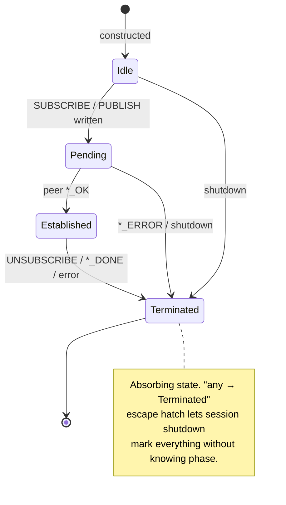

### Locking strategy

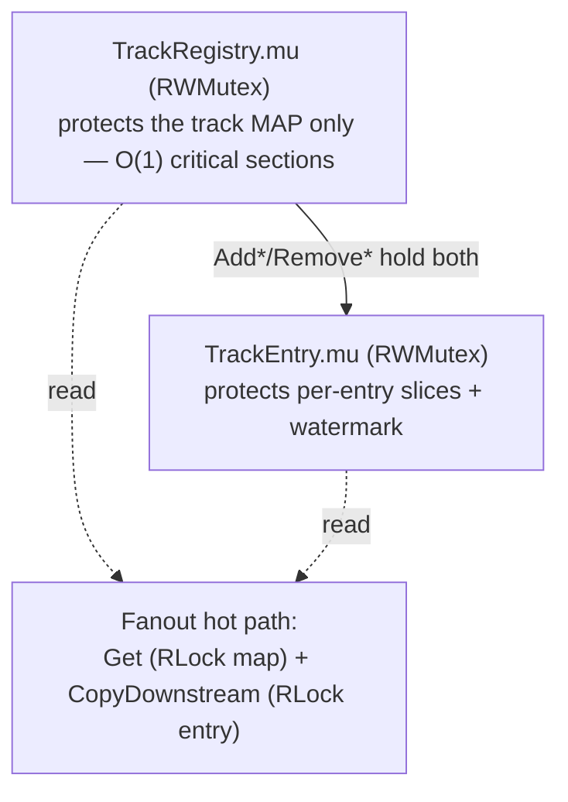

- The **registry lock** guards only the map, keeping its critical sections O(1).
- **Per-entry state** lives behind `TrackEntry.mu`, so fanouts on *different*
  tracks run fully in parallel.
- `Add*` / `Remove*` hold the registry write lock for the *whole* operation.
  This is stricter than necessary but closes a resurrection race: a concurrent
  `Remove` could otherwise delete the entry from the map after `GetOrCreate`
  returns but before the caller locks the entry, leaving a mutator working on an
  entry no future `Get` can reach. Add/Remove frequency is dwarfed by fanout, so
  the extra serialization is free on the hot path.

---

## 4. Request dispatch

`runRequestLoop` calls `AcceptRequest` and hands each `*session.Request` to
`dispatch`, which type-switches on the first message and spawns a handler
goroutine. Every handler follows the same shape: **authorize → reply OK/ERROR →
mutate registry → keep the bidi stream open for the subscription's lifetime →
clean up on exit.**

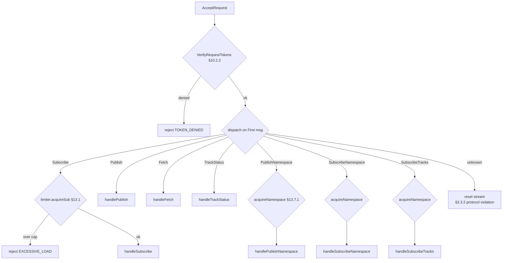

Token verification (§10.2.2) and the per-session limiter (`limiter.go`) both run
*before* any state mutation, so a rejected request leaves the relay untouched.

---

## 5. The publish/subscribe data path

### 5.1 Namespace plumbing

Before objects flow, publishers advertise namespaces and subscribers express
interest in prefixes. The `NamespaceRegistry` answers two prefix-match queries
with linear scans (namespace cardinality is low and off the object hot path):

- `MatchPublishers(ns)` — every publisher whose advertised namespace is a prefix
  of `ns`. Used by the SUBSCRIBE handler to find an upstream.
- `MatchSubscribers(ns)` — every subscriber whose registered prefix is a prefix
  of `ns`. Used by PUBLISH_NAMESPACE / PUBLISH to fan notifications downstream.

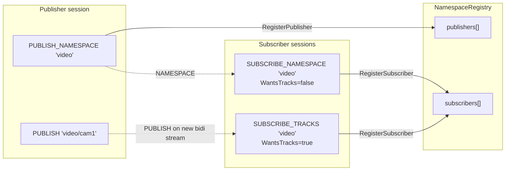

`SUBSCRIBE_NAMESPACE` holders receive `NAMESPACE` / `NAMESPACE_DONE` messages;
`SUBSCRIBE_TRACKS` holders receive forwarded `PUBLISH` messages (each on its own
new bidi stream). When a subscriber's stream credit is exhausted, the relay
sends `PUBLISH_BLOCKED` (§6.1 / §10.20) and records a sticky prohibition in the
`SubscriberEntry.blocked` set — it MUST NOT forward that track again until the
subscriber issues a SUBSCRIBE, which calls `ClearBlockedForSession`.

### 5.2 SUBSCRIBE + on-demand upstream subscribe + §9.4 aggregation

This is the heart of the relay. When a downstream SUBSCRIBE arrives with no
established upstream, the relay subscribes upstream itself — and crucially, it
subscribes with the **Largest Object filter** regardless of what the downstream
asked for, so one upstream subscription can serve many disparate downstream
filters without churn. Each downstream filter is enforced on the wire by the
fanout.

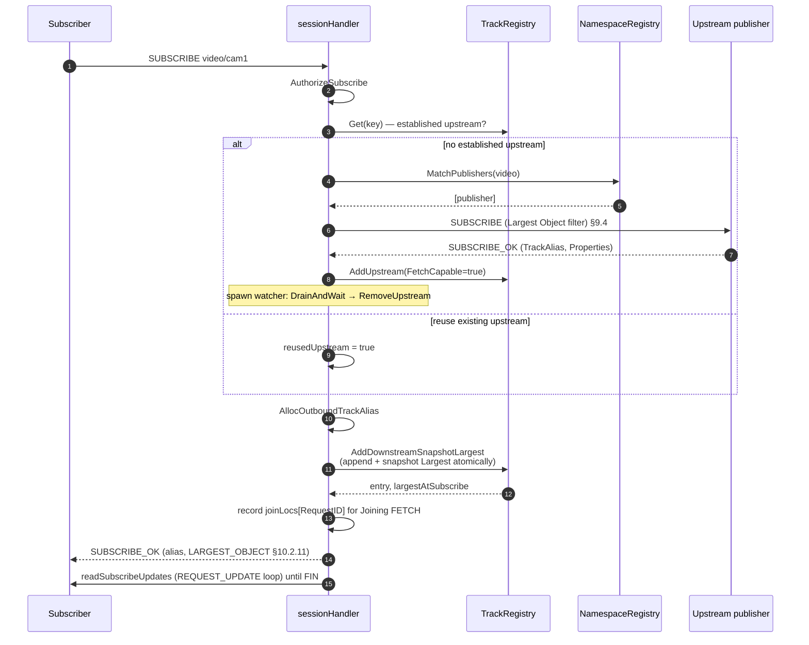

**The atomic snapshot (`AddDownstreamSnapshotLargest`) is load-bearing.** It
appends the `DownstreamSub` to `entry.Downstream` *and* reads `LargestObject`
under a single `entry.mu` acquisition. This serializes against the fanout's
`updateLargestAndDetectNew` (which also locks `entry.mu`), guaranteeing that a
new subscriber either:

- snapshots the *pre*-update Largest **and** appears in the fanout's next
  downstream scan (so the object is delivered live), or
- snapshots the *post*-update Largest (so the object is covered by its Joining
  FETCH).

Either way there is no gap. If the snapshot and append happened in separate lock
cycles, a publisher write between them could advance Largest and cache an object
without ever delivering it live — a hole neither path covers.

### 5.3 Object fanout (subgroup streams)

An inbound `SUBGROUP_HEADER` stream produces one outbound subgroup stream *per
downstream subscriber*, each driven by a dedicated **writer goroutine** fed by a
bounded channel. The publisher's Track Alias is remapped to each subscriber's
per-session outbound alias.

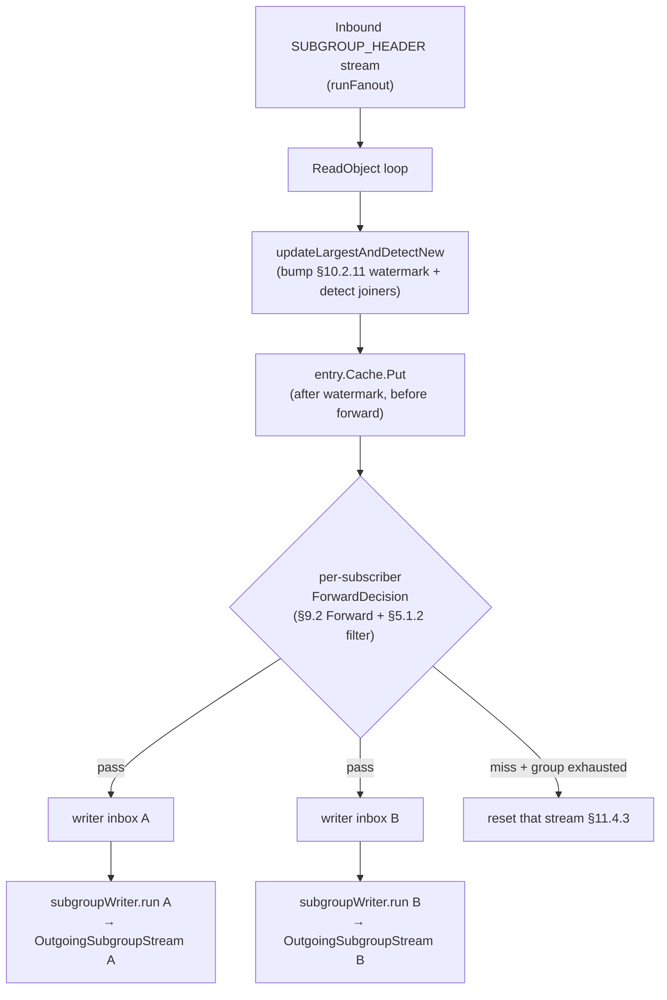

Things the fanout gets right per the spec:

- **`ObjectIDDelta` re-encoding (§11.4.2).** The wire delta is relative to the
  *previous object on the same stream*. Once filter drops or gap-driven resets
  punch holes in the forwarded sequence, the relay must re-encode the delta on
  the outbound side or the subscriber's decoded absolute IDs drift. Each
  forwarded object carries its absolute ID (`fwdObject.absID`) for exactly this.
- **Gap-driven reset/reopen (§11.4.3).** A non-consecutive Object ID forces the
  writer to reset its current outbound stream and open a fresh one — the relay
  MUST NOT forward a non-consecutive object on an existing subgroup stream.
- **FIN-vs-reset propagation (§11.4.3).** A clean inbound EOF FINs the outbound
  streams; an inbound reset (or ctx cancel, or post-terminal-object malformed
  track) resets them with the mapped §3.3.3 code.
- **Mid-stream joiners.** A subscriber that joins `entry.Downstream` after the
  initial snapshot is detected per-object (via `downstreamGen` + the
  seen-writers map) and gets a `ReplayingSubgroup=true` writer. A
  `downstreamGen` check skips the O(n) joiner scan when membership is unchanged
  (the common case).
- **Zero-subscriber drain (§9.7).** The inbound stream is read even with no
  subscribers so the publisher's flow control never stalls.

### 5.4 Slow-reader shedding (§8)

Each writer's inbox is a bounded channel. The fanout publishes with a
**non-blocking send** — on overflow the object is dropped. The primary
slow-reader signal is a **latency window**, not a drop count:

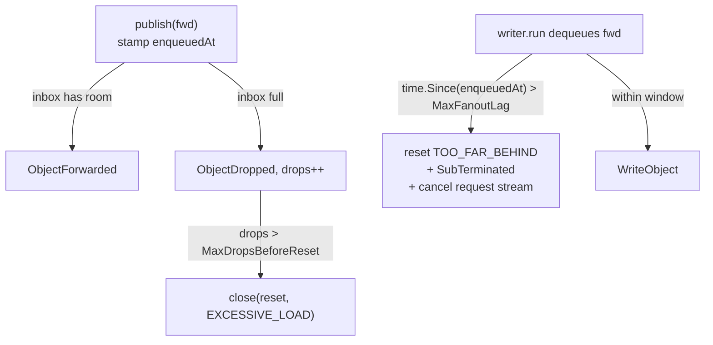

- **`MaxFanoutLag`** (default 2s): if a dequeued object waited longer than this,
  the subscriber has been unable to keep up — the writer resets its outbound
  stream with `TOO_FAR_BEHIND`, transitions the sub to `SubTerminated`, and
  cancels the request stream so the handler's `defer` evicts it from the
  registry. A subscriber that drops the occasional object but stays current is
  left alone.
- **`MaxDropsBeforeReset`** (opt-in, default disabled): a coarse cumulative-drop
  backstop that resets with `EXCESSIVE_LOAD` — bounds memory for a peer that
  accepts a stream but never reads it. A lag breach wins if both fire.

### 5.5 Datagram fanout

`runDatagramLoop` / `handleDatagram` mirror the subgroup path but flat: no
writer goroutine, no stream lifecycle, no delta re-encoding (datagrams carry an
absolute Object ID, §11.3.1). Per §11.3 a datagram is fire-and-forget, so send
failures and unknown-alias lookups are dropped silently. Forwarded datagrams
still bump the §10.2.11 watermark and are written to the cache.

---

## 6. FETCH and fetch stitching

FETCH (§9.4, §10.12) serves a requested object range from the per-track cache.
Gaps in the response stream are how the spec signals "objects do not exist"
(§11.4.4) — but the relay must distinguish two kinds of gap:

- A gap **at or above** the cache's eviction floor is *ground-truth
  non-existence*.
- A gap **below** the floor means the object was evicted or never cached — it
  *might* still exist upstream.

**Fetch stitching** fills that below-floor portion from an upstream FETCH when a
fetch-capable upstream is reachable, then concatenates it with the cached part.

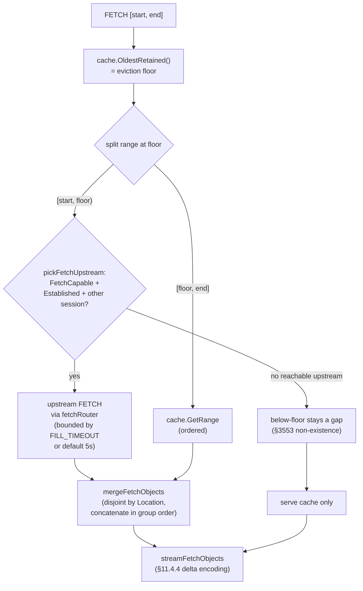

Notes and deliberate limitations:

- **Only on-demand upstreams are fetch-capable.** `subscribeUpstream` marks an
  upstream it reached via SUBSCRIBE as `FetchCapable` (a relay/origin expected
  to answer FETCH). A directly-connected *leaf* publisher pushes live objects and
  is not expected to serve FETCH, so stitching skips it. `pickFetchUpstream`
  also skips the requester's own session to avoid a self-loop.
- **Upstream-fetched objects are NOT written back to the cache.** The cache is a
  FIFO ring keyed by arrival; inserting old backfill would evict live data.
- **`FETCH_OK` is sent before stitching.** The response `EndLocation` is fixed by
  the watermark (§3604–3605) and independent of which objects stream, so the OK
  goes out before any (possibly slow) upstream round-trip.
- Range validation up front: `INVALID_RANGE` when nothing's published, end <
  start, or start > largest (§3576, §3585).

### The fetch router

The upstream FETCH response arrives as an `IncomingFetchStream` on the *upstream
session's data loop* — a different goroutine from the downstream handler that
issued the FETCH. They rendezvous on `fetchRouter`, keyed by
`(session, RequestID)`:

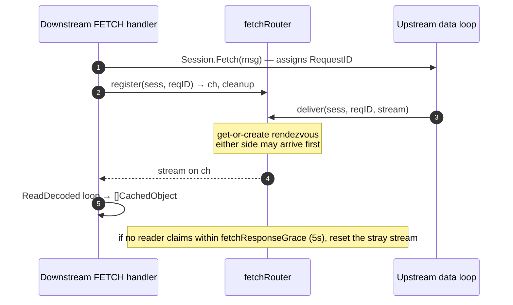

Because the Request ID is only known *after* `Fetch` returns, a fast upstream
can race registration; the router get-or-creates the channel from either side and
buffers the stream until claimed.

### Joining FETCH (§10.12.2)

A Joining FETCH references an active SUBSCRIBE by Request ID to backfill the
gap between "subscribe time" and "first live object". `handleSubscribe` records
a `joiningLocation` snapshot in `joinLocs[RequestID]` at SUBSCRIBE_OK time;
`handleJoiningFetch` recovers it and computes the range per §10.12.2.1:

- End = `{Joining.Group, Joining.Object + 1}`
- Absolute: Start = `{JoiningStart, 0}`
- Relative: Start = `{Joining.Group − JoiningStart, 0}`

then serves it through the same `stitchedFetchObjects` + `streamFetchObjects`
path as a standalone FETCH.

---

## 7. The per-track Object Cache

`cache.ObjectCache` (one per `TrackEntry`) is a fixed-capacity **FIFO ring
buffer** with an auxiliary `{GroupID, ObjectID} → slot` index for O(1) point
lookup and overwrite-in-place.

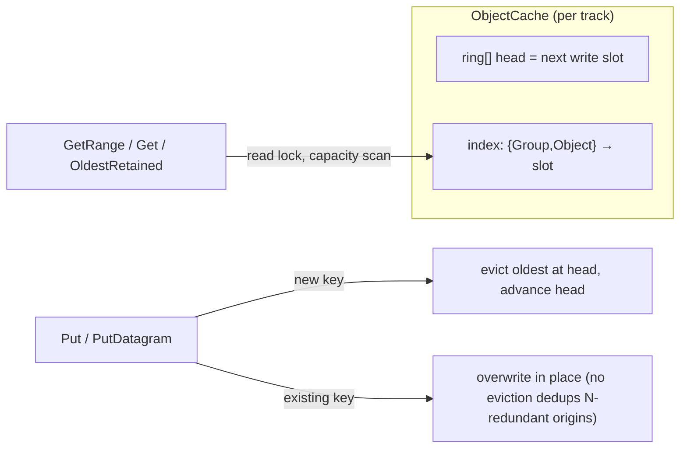

Design points:

- **Stored by reference, never mutated in place.** `Put` keeps the
  `*CachedObject` (and its payload/properties slices) by reference — no per-object
  copy on the hot path. An evicted struct is simply orphaned from the ring and
  stays valid for any holder, so `Get` / `GetRange` can hand out raw pointers
  without a torn-read hazard.
- **Two eviction axes.** Size-bounded (oldest-first on a full ring) and
  time-bounded (per-entry TTL applied lazily *at read time* — no background
  goroutine). `MaxCacheSize` / `MaxCacheDuration` come from `Config`; a
  `CacheTTLPolicy` hook can override the TTL per track (e.g. infinite retention
  for an MSF catalog track) without coupling `pkg/relay` to any Track-Name
  vocabulary.
- **RWMutex.** FETCH range scans take the read lock so a flash crowd of joining
  subscribers scans in parallel, contending only with the short live-ingest
  `Put`.
- Each track's cache is bounded independently — a noisy track can't evict a
  quiet one's entries.

---

## 8. Cross-instance discovery

`discovery.DiscoveryStore` is the abstraction for multi-relay deployments. It
answers "which relay hosts a publisher for this track / namespace prefix?". The
default `MemoryStore` keeps state local, so a single relay with `MemoryStore`
behaves identically to one with no discovery at all.

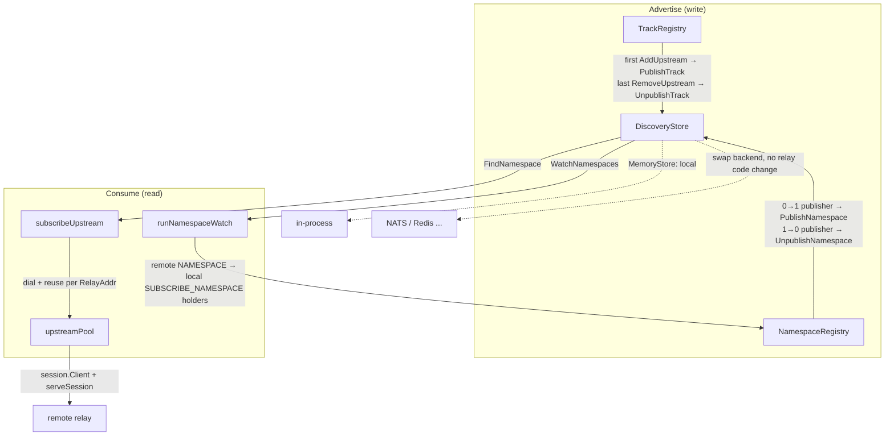

**Advertise side.** The registries mirror publish/unpublish events into the
store (best-effort: each call is bounded by a 100ms timeout and failures are
logged, never propagated — the local registry is the source of truth).
Discovery calls are *coalesced* via refcounts (`pubCount`, the upstream-slice
non-empty transition) so N publishers of the same namespace on one relay
produce one entry.

**Consume side.** When `Config.Dialer` is set, the relay also *reads* Discovery
to route across instances:

- **On-demand cross-relay SUBSCRIBE.** `subscribeUpstream` first tries a local
  publisher (§9.5); when none matches it calls `FindNamespace`, skips its own
  `RelayAddr` (loop guard), and asks the `upstreamPool` to dial the remote
  relay. The pool keeps one session per `RelayAddr` and runs the relay's normal
  per-session loops on it (via `serveSession`, the same body `handleConn` uses
  after SETUP), so a dialled upstream's inbound data fans out and its FETCH
  responses route through the fetch router exactly like an accepted session's.
- **Namespace reflection.** `runNamespaceWatch` (one goroutine, started in
  `Start` when Discovery is set) consumes `WatchNamespaces` and forwards
  namespaces advertised by *other* relays to local SUBSCRIBE_NAMESPACE holders
  as NAMESPACE / NAMESPACE_DONE. Own-relay events are skipped — the
  PUBLISH_NAMESPACE handler already forwards those locally.

`WatchTracks` is intentionally not consumed: on-demand `FindNamespace` covers
track routing without eagerly (and wastefully) pre-subscribing to every remote
track.

> **Out of scope (single-instance reference).** Loop prevention is limited to
> skipping this relay's own `RelayAddr`; multi-hop cycle detection (A→B→C→A) is
> not implemented. There is no upstream connection-health/redial policy beyond
> dial-on-demand (a dead pooled session is evicted and re-dialled on the next
> SUBSCRIBE), and the only bundled backend is the local `MemoryStore` —
> production `DiscoveryStore` backends (NATS / Redis) are a backend swap.
> `runNamespaceWatch` consumes the event *stream* only (no `FindNamespace`
> snapshot on start), so namespaces advertised before it registered are not
> reflected until re-advertised; on-demand `SUBSCRIBE` still resolves them via
> `FindNamespace`.

---

## 9. Pluggable hooks

| Hook | Interface | Default | When invoked |
|------|-----------|---------|--------------|
| **Authorization** | `Authorizer` (per request type) | `AllowAllAuthorizer` | Once per request, *before* any state mutation. Bounded by request rate, not object rate. Return a `*DeniedError` to choose the REQUEST_ERROR code; a plain error maps to `RequestUnauthorized`. |
| **Metrics** | `Metrics` | `NopMetrics` | Lifecycle (session/subscription open/close) + hot-path (`ObjectForwarded` / `ObjectDropped` per subscriber). MUST be non-blocking; embed `NopMetrics` for forward-compatibility. |
| **Discovery** | `DiscoveryStore` | nil (single-instance) | Track/namespace advertise + unadvertise. |
| **Cache TTL** | `CacheTTLPolicy` | nil (use default) | Once per `TrackEntry` at creation, off the hot path. |

Per-session resource caps (`limiter.go`) are pure `Config` knobs:
`MaxSubscriptionsPerSession` (§13.1) and `MaxNamespaceRequestsPerSession`
(§13.7.1). Both default to unlimited — limits are a deployment policy the
operator opts into — and over-limit requests are rejected with `EXCESSIVE_LOAD`
before any state mutation.

---

## 10. Concurrency model summary

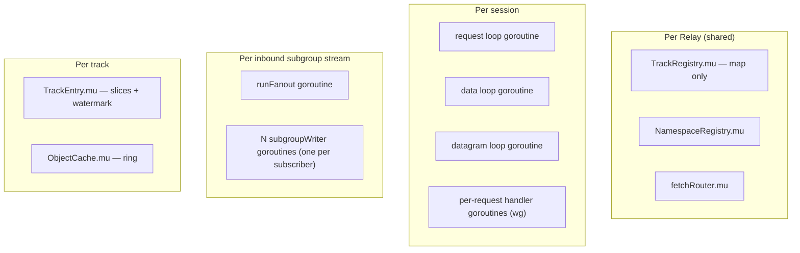

The invariants that keep this safe:

- **Registry lock ⊃ entry lock** ordering; `Add*`/`Remove*` hold both.
- The **atomic append+snapshot** (`AddDownstreamSnapshotLargest` ↔
  `updateLargestAndDetectNew`) closes the subscribe/fanout gap race.
- Stream I/O (PUBLISH_DONE writes, discovery backend calls) is always done
  *outside* the registry locks — snapshot under lock, act after unlock.
- **Belt-and-suspenders teardown.** Per-request handlers remove their own
  subscriptions on clean exit, but `handleConn`'s `defer` also calls
  `tracks.RemoveSession` / `names.RemoveSession` unconditionally, so a wedged or
  raced handler can never leave a dangling registry entry referencing a dead
  session.

---

## 11. Quick reference — where does X live?

- **"How does a subscriber get backfilled history?"** → Joining FETCH +
  `joinLocs` (`handler_subscribe.go`, `fetch.go`).
- **"Why didn't my slow subscriber get every object?"** → `MaxFanoutLag` /
  `MaxDropsBeforeReset` shedding (`fanout.go` §5.4).
- **"How does one upstream serve many downstream filters?"** → §9.4 Largest
  Object aggregation in `subscribeUpstream`; per-downstream `ForwardDecision`
  filtering in `runFanout`.
- **"What fills gaps the cache evicted?"** → fetch stitching
  (`stitchedFetchObjects`, `fetch.go` §6).
- **"How are reset codes chosen?"** → centralized in `pkg/moqt/errors.go`;
  fanout maps inbound-reset / lag / drop-cap to §3.3.3 codes in `subgroupWriter`.
- **"How do I gate who can publish/subscribe?"** → implement `Authorizer`
  (`auth.go`), install via `Config.Authorizer`.
</content>
</invoke>
